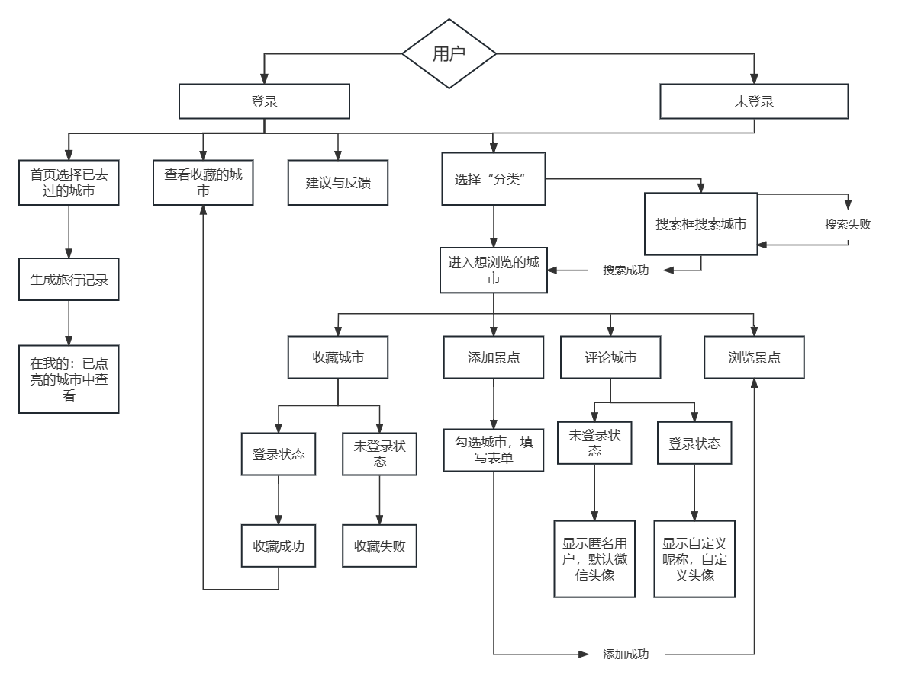

# 系统开发文档
## 系统概述
本系统是基于为了方便大家计划旅游攻略，更快速找到景点的具体信息的小程序。使用该小程序更方便快捷的获取相关城市的有效信息，且使用人数越多，评论、景点会更加完善，更有助于搜集到有效信息，提升旅游时的幸福度
## 运行环境
### 微信小程序运行在多种平台上：iOS（iPhone/iPad）微信客户端、Android 微信客户端、PC 微信客户端、Mac微信客户端和用于调试的微信开发者工具。
## 业务流程设计

## 功能设计
用户可首先选择登录或不登录，若登录，则可使用全部功能。具体的功能如下:
 1.生成旅行记录：在首页生成专属用户的旅行记录。通过选择已经走过的城市，生成旅行记录，可获得走过的城市个数，走过中国百分之多少国土的信息。城市表单可在我的-已点亮的城市中查看。 
 2.浏览城市信息：在分类一栏可选择您想浏览的城市，手动查找，点击城市名称即可跳转到相应的城市界面。在城市界面，可浏览该城市中的各个景点，评论区广大网友提供的建议。 
3.搜索城市：如果找不到您想浏览的城市，可通过搜索框搜索，如果输入了正确的城市信息，可自动跳转， 如果输入了不正确的城市信息，将会弹出提示提醒您重新输入。
 4.发送评论：如果您对于您走过的城市有良好的建议，也同样可以在评论区留言，登录状态下将会显示自定义的头像和昵称，未登录状态下为默认头像，昵称为"匿名用户"。 
 5.添加景点：如果您对该景点非常了解且乐于提供相关信息，可填写表单上景点的名称、级别、门票价格、简介和景点图片来供大家参考。 
 6.收藏城市：点亮各个城市中的星星图标，可成功将城市收藏。可在我的-我的收藏中查看。
 7.建议与反馈：小程序尚处于起步阶段，可以随时向我提出建议与疑问。您可同样查看其他人的疑问与解决办法。
若不登录，可使用浏览城市信息，搜索城市，发送建议与反馈功能。
## 数据库设计
数据库主要用于存储城市信息citylist。城市信息citylist有基本实体集：城市city，景点jingdian，评论pinglun。其中，景点jingdian的属性集为：景区名称name，景区等级star，门票价格ticket，景点介绍intro和景区照片img；评论pinglun的属性集为：昵称name，头像avatarUrl，评论内容content。各实体间的联系为：可以存在多个城市，每个城市可以有多个景点，多个评论。
## 关键算法设计
生成旅行记录功能利用change函数，得到存储已经走过的城市的数组detailValue，再利用数组的个数和数组中具体城市和对应所占中国的国土面积来计算走过城市个数和走过中国百分之多少的国土：
    change(e) {
    let string = "cityList[" + e.target.dataset.index + "].selected"
    this.setData({
      [string]: !this.data.cityList[e.target.dataset.index].selected
    })
    detailValue = this.data.cityList.filter(it => it.selected).map(it => it.value)
    //console.log('所有选中的值为：', detailValue)
    },
在搜索框输入城市，若输入正确可自动跳转到相应城市页面：
    getSearch(event){
    //获取城市名称
    this.setData({
      city1:event.detail.value,
    })
    //console.log("获取城市成功",this.data.city1)
    //通过城市名称判断ID，若无法判断出ID则弹出提示信息输入城市名称错误
    if(ID!=""){
      this.setData({
        city1:"",
      })
      //根据ID自动跳转到相应城市
      wx.navigateTo({
        url:"/pages/detail/detail?id="+ID,
      })
      ID=""
    }
利用bindinput获取到评论信息，调用云函数caozuo获取到城市的原有评论，再将新输入的评论加入其中：
    //获取用户评论
    getContent(eve){
    this.setData({
      content:eve.detail.value
    })
    },
    // 发表评论
    submitCom(){
    let content=this.data.content
    //若评论长度小于3，弹出提示
    let pinglunItem={}
    let name=""
    let avatarUrl=""
    let user = wx.getStorageSync('user')
    //设置评论者的头像和昵称
    pinglunItem.name=name
    console.log("name=",name)
    pinglunItem.content=content
    pinglunItem.avatarUrl=avatarUrl
    let pinglun1=this.data.pinglun
    pinglun1.push(pinglunItem)
    // 发表提示信息
    //调用云函数将评论数组上传到数据库
    wx.cloud.callFunction({
      name:"caozuo",
      data:{
        action:"fabiao",
        pinglun:pinglun1,
        id:ID,
      }
    }).then(res=>{
      console.log("发表成功",res)
      this.setData({
        pinglun:pinglun1,
        content:""
      })
      // 隐藏提示信息
    },
将景点照片上传至云存储中
    // 上传照片到云数据库
    uploadImg(fileUrl){
    wx.cloud.uploadFile({
      //上传至云端的路径,如果只显示第一张就每次换名字
      cloudPath:new Date().getTime()+'.png',
      //小程序临时文件路径
      filePath:fileUrl,
      success:res=>{
        img=res.fileID
        console.log("上传成功",img)
        this.setData({
          imgUrl:res.fileID
        })
      },
      fail:console.error
    })
    },
## 部署与运行
- 编程语言：wxml，wxss，JavaScript
- 开发环境：微信开发者工具 
## 心得与展望
1.初步掌握了html，css，JavaScript三种语言，对于小程序方面的程序设计有一些了解。
2.更学会了面对不同的作品需要做出不同的处理。比如小程序有着更新迭代快速的特性，可能更新之后权限的改变，之前的函数便不再能使用或不在好用，所以就意味着要不断更新源码，不断学习新的更好用的函数和知识。 
3.提升了自身独立处理问题的能力。相较于上学期面对较小的编程量还总是问助教，这次我将代码的编写分成了几个部分，逐个部分完成，有问题先搜索领悟，再寻求帮助。
